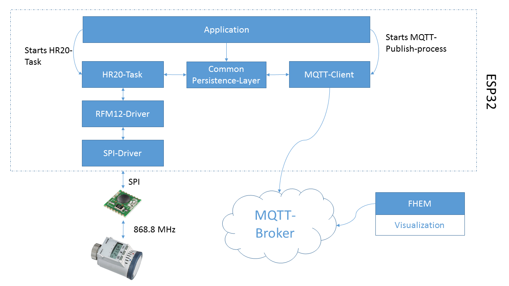

# ESP32-OpenHR20
This project follows the goal of controlling Honeywell-Thermostats with OpenHR20 using an ESP32 and a RFM12.

Important: This project is a work in progress! Currently, the transmitting and receiving of the RFM12B-Module won't work as expected.

## System Architecture  

## Todo-List: 
Currently, the modules have the following state: 
 * SPI-driver: Completed
 * RFM12-driver: Completed, but still has several bugs
 * HR20-task: To be completed! 
 * Persistance-Layer: To be completed! 
 * MQTT-Client: To be completed! 
